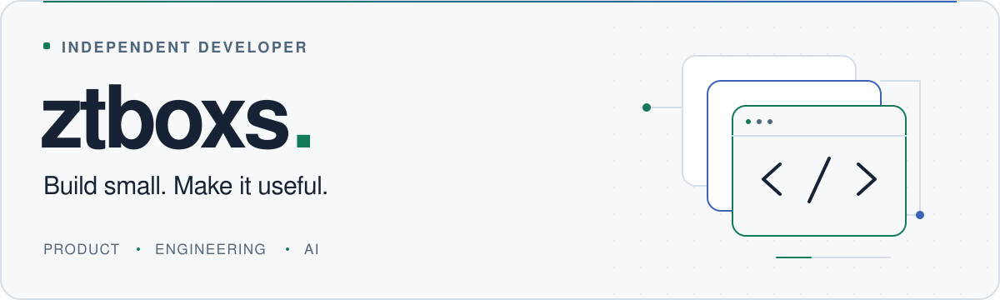

<picture>
  <source media="(prefers-color-scheme: dark)" srcset="./assets/hero-dark.svg">
  <source media="(prefers-color-scheme: light)" srcset="./assets/hero-light.svg">
  
</picture>

  <strong>Independent developer · Full-stack engineer · AI product explorer</strong>

  <a href="./README.md">简体中文</a> · <strong>English</strong>
   
  <a href="#about">About</a> · <a href="#projects">Public projects</a> · <a href="#toolbox">Toolbox</a> · <a href="#connect">Connect</a>

---

## Turning ideas into useful products

Hi, I'm **ztboxs**, an independent developer interested in **AI applications, full-stack products, and developer tools**.

I like starting with a concrete problem and connecting product design, frontend and backend development, and deployment. I care more about a useful experience and a clear system than a long list of technologies.

**What I'm exploring**

- **AI in real workflows**: connecting models and tools, not just adding a chat box.
- **Ideas into products**: testing a focused prototype, then improving it with feedback.
- **Developer experience**: reducing repetitive work across development, testing, and delivery.

## Public projects

A selection of code and experiments you can explore. Each repository's documentation is the reference for its features and usage.

### [mcp-demo](https://github.com/ztboxs/mcp-demo)
**Image compression as a tool AI can call.**

An MCP-based image compression service with single-image and batch operations, plus an optional HTTP interface. An experiment in connecting a small, well-defined task to an AI workflow.

`Python` `MCP` `FastAPI` · [Explore the code →](https://github.com/ztboxs/mcp-demo)

### [Sips-Sober](https://github.com/ztboxs/Sips-Sober)
**A full-stack application exploring cocktail-making workflows.**

Built with React and Spring Boot, with a product experience organized around cabinet management, recipe discovery, and mixing guidance. A concrete use case connecting interface design and backend engineering.

`React` `TypeScript` `Spring Boot` · [Explore the code →](https://github.com/ztboxs/Sips-Sober)

### [SaaSTemplate](https://github.com/ztboxs/SaaSTemplate)
**A clearer starting point for the next web product experiment.**

A React, TypeScript, and Vite frontend template that brings together themes, internationalization, routing, and reusable components to reduce repetitive setup work.

`React` `TypeScript` `Vite` `Tailwind CSS` · [Explore the code →](https://github.com/ztboxs/SaaSTemplate)

## Toolbox

Choose tools for the problem, not the other way around.

| Area | Technologies I use and explore |
| :--- | :--- |
| **Web & interfaces** | TypeScript · JavaScript · React · Vue |
| **Backend & services** | Java · Spring Boot · Python · Node.js |
| **Mobile** | Flutter · Dart |
| **Data & caching** | MySQL · PostgreSQL · Redis |
| **Delivery & engineering** | Docker · Linux · Nginx · Git |

More tools I've worked with

Go · Express · MongoDB · Jenkins · RabbitMQ

## How I build

**Understand the problem. Narrow the scope. Get something working early.**

Use feedback to choose the next step and clear boundaries to manage complexity. Keep code, documentation, and actual behavior aligned, with room for future maintenance.

## Let's connect

Thoughtful discussions about implementation, bugs, and improvements are welcome. For project-specific conversations, start with **Issues** or **Pull Requests** in the relevant repository.

---

  Start with a real problem. Build something useful.

